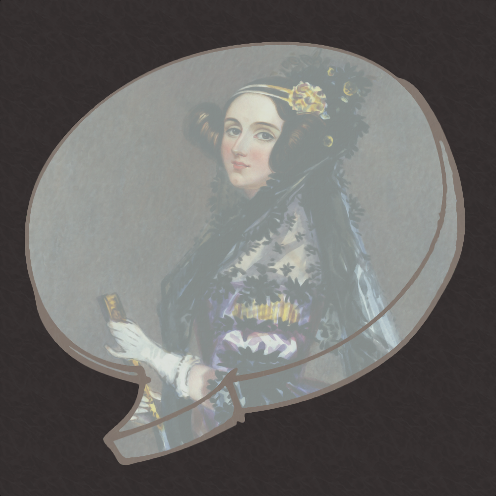

 <b> ADA Simple Chat Server </b> 

 <b> About: </b> 

 Just a small personal project to learn ADA and improve my overall understanding and knowledge. 

 <b> TODO: </b> 

 1. Finish the html. 

 2. Filter user inputs. 

 3. Fix any issue i run into. 
